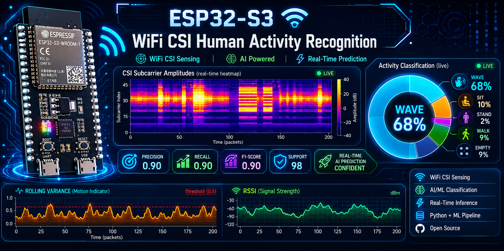
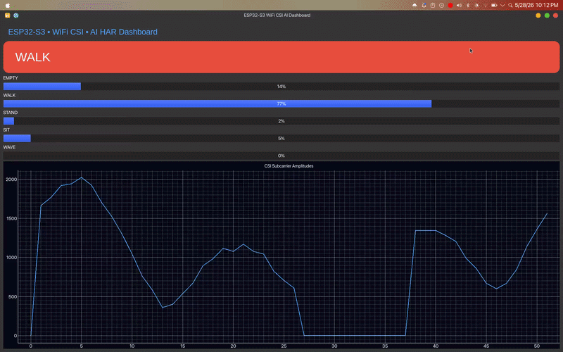
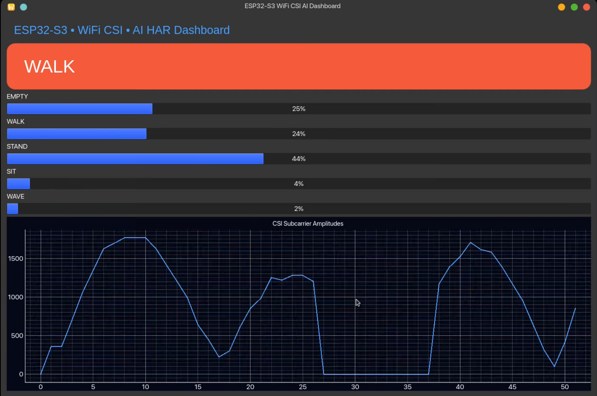
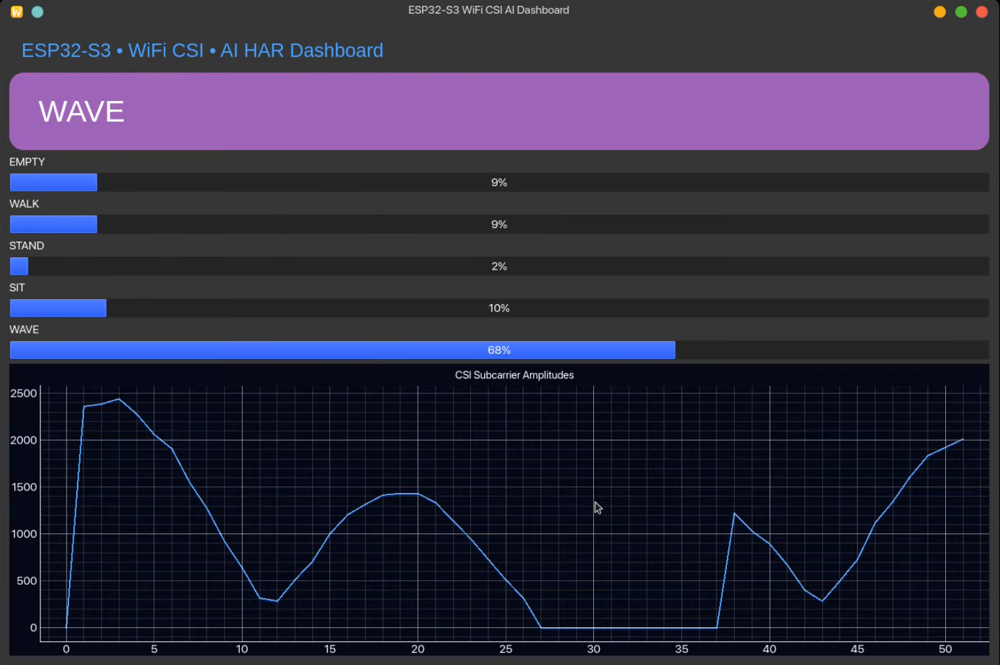
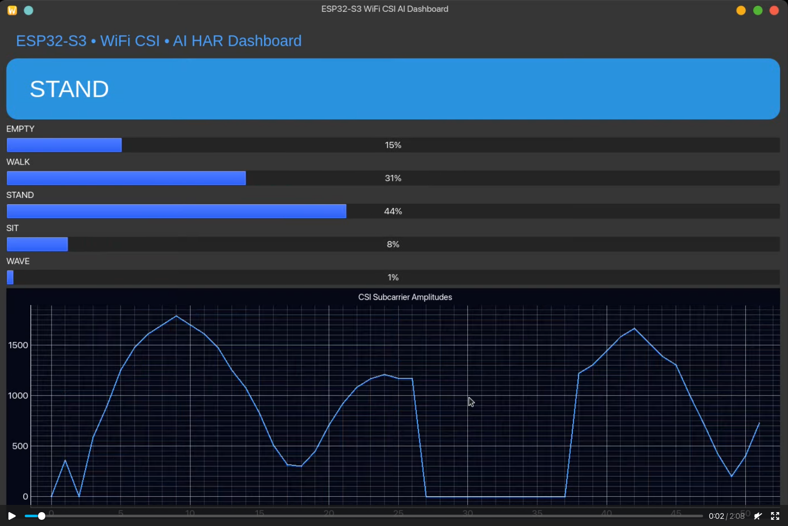
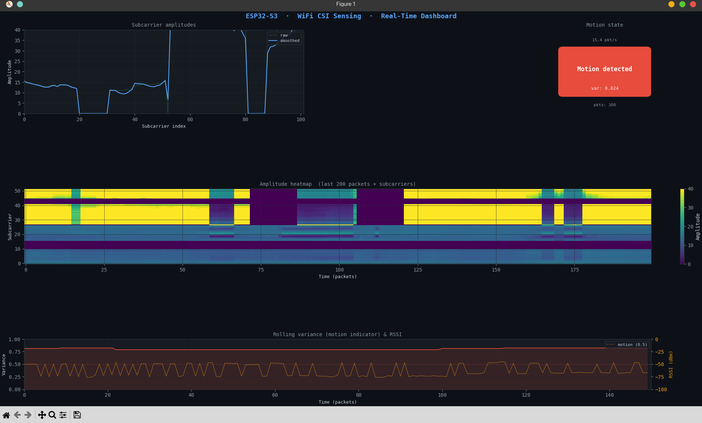
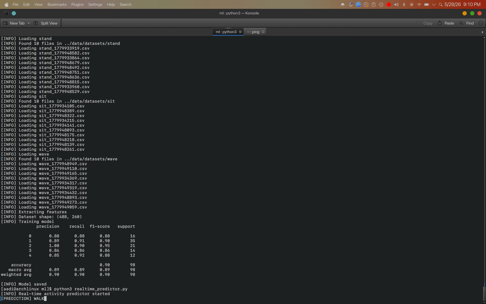
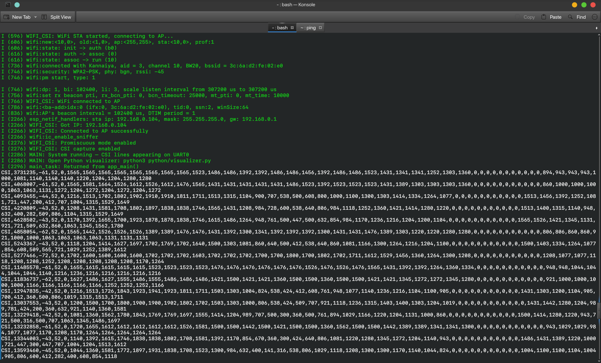
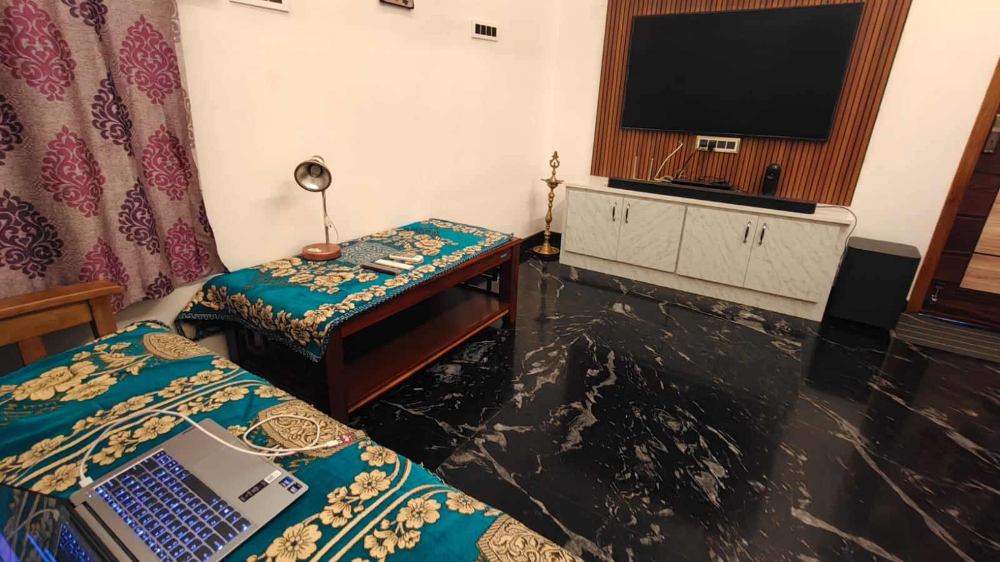
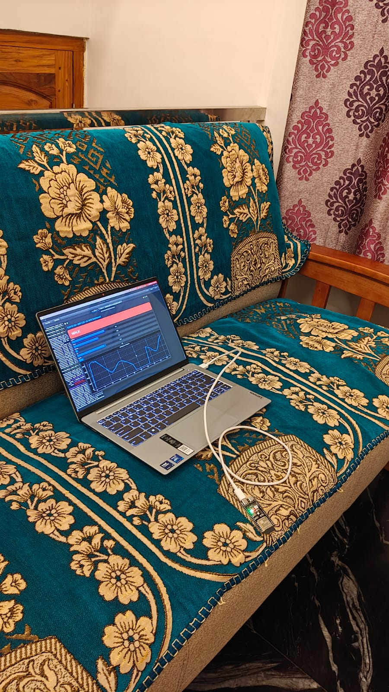

# 📡 ESP32-S3 WiFi CSI Sensing for Human Activity Recognition

<p align="center">
  
</p>

<p align="center">
  
  
  
  
  
</p>

A research-oriented **WiFi CSI Human Activity Recognition (HAR)** platform built around **ESP32-S3**, real-time CSI streaming, feature-based ML inference, and a live analytics dashboard. This repository is designed for embedded AI portfolios, RF sensing demonstrations, and internship/research applications.

---

## ✨ Feature Highlights

- 📶 **ESP32-S3 CSI Capture** over WiFi with serial packet streaming
- 🧪 **RF Sensing Pipeline** from raw CSI amplitude to activity labels
- 🤖 **ML Training + Inference** for HAR (`empty`, `walk`, `stand`, `sit`, `wave`)
- 📊 **Real-Time Dashboard** with confidence bars and CSI waveform plotting
- 🗂️ **Dataset Collection Workflow** for reproducible activity sessions
- 📚 **Research-Grade Documentation** for setup, architecture, demo, and training

---

## 🏆 Key Achievements

- Built realtime WiFi CSI HAR system on ESP32-S3
- Achieved 90% classification accuracy
- Designed live PyQt RF dashboard
- Implemented CSI preprocessing + feature extraction pipeline
- Developed embedded-to-ML end-to-end workflow

## 🧠 Project Overview

This project demonstrates how commodity WiFi hardware can be used as a non-invasive RF sensing modality for activity recognition. The ESP32-S3 firmware captures CSI measurements, streams packets over UART, and Python-based tooling processes data for model training and real-time prediction.

**Positioning:**

- WiFi CSI Human Activity Recognition system
- Embedded AI + signal processing platform
- Real-time RF analytics dashboard
- ESP32-S3 CSI sensing research testbed

---

## 🏗️ Architecture Overview

```text
┌──────────────────────┐
│  Human Motion Scene  │
└──────────┬───────────┘
           │ affects channel state
           ▼
┌──────────────────────┐
│   WiFi AP + ESP32-S3 │
│   (CSI Capture Node) │
└──────────┬───────────┘
           │ CSI packets over UART
           ▼
┌──────────────────────┐
│ Python Serial Logger │
│  + Dataset Storage   │
└──────────┬───────────┘
           │ windowing + feature extraction
           ▼
┌──────────────────────┐
│   ML Model Training  │
│  (Random Forest HAR) │
└──────────┬───────────┘
           │ model + real-time CSI frames
           ▼
┌──────────────────────┐
│ Realtime Inference & │
│ Dashboard Visualizer │
└──────────────────────┘
```

For detailed architecture documentation, see `docs/architecture/system_architecture.md`.

---

## 🔁 End-to-End Pipeline

| Stage | Component | Output |
|---|---|---|
| 1 | ESP32-S3 firmware (`firmware/`) | CSI lines streamed over UART |
| 2 | Serial logging (`python/logger.py`, `python/serial_reader.py`) | Labeled CSV recordings |
| 3 | Dataset loading (`ml/dataset_loader.py`) | Windowed training samples |
| 4 | Feature extraction (`ml/features.py`) | Numeric feature vectors |
| 5 | Model training (`ml/train.py`) | `ml/models/activity_model.pkl` |
| 6 | Realtime inference (`ml/realtime_predictor.py`) | Live activity predictions |
| 7 | Dashboard (`ml/dashboard.py`) | Interactive RF analytics UI |

---

---
## 🎥 Live Demo

<p align="center">
  
</p>

## 🖼️ Screenshots & Showcase

### 📊 Main Dashboard — Walking Detection

<p align="center">
  
</p>

---

### ✋ Activity Recognition — Wave Gesture

<p align="center">
  
</p>

---

### 🧍 Activity Recognition — Standing Detection

<p align="center">
  
</p>

---

### 🌈 CSI Heatmap Visualization

<p align="center">
  
</p>

---

### 🤖 ML Prediction Outputs

<div align="center">




</div>

---

### 📡 ESP32-S3 Firmware Serial Monitor

<p align="center">
  
</p>

---

### 🔧 Hardware Setup

<div align="center">




</div>

---

## 🎥 Demo Video

```text
docs/videos/demo.mp4
```


## 📈 Example Results

| Metric | Value |
|---|---|
| Activities Recognized | 5 |
| ML Model | Random Forest |
| Dataset Windows | 488 |
| Feature Vector Length | 260 |
| Accuracy | 90% |
| Platform | ESP32-S3 |
| Interface | Real-Time PyQt Dashboard |

---

## 🧾 Supported Activities

| Label ID | Activity |
|---|---|
| 0 | EMPTY |
| 1 | WALK |
| 2 | STAND |
| 3 | SIT |
| 4 | WAVE |

---

## 🔌 Hardware Requirements

- ESP32-S3 development board (CSI-capable firmware target)
- USB data cable
- Linux/macOS/Windows host machine
- WiFi environment with stable AP conditions
- Optional tripod/marker for repeatable sensing zone setup

## 💻 Software Requirements

- Python 3.10+ (tested with 3.11)
- ESP-IDF (for firmware build/flash)
- `pip` and virtual environment tooling
- Serial access permissions (`dialout`/`uucp` group on Linux)

---

## 🚀 Installation Guide

```bash
git clone https://github.com/b24es1005-debug/esp32s3-wifi-csi-sensing.git
cd esp32s3-wifi-csi-sensing
python3 -m venv .venv
source .venv/bin/activate
pip install -r requirements.txt
```

See full setup notes: `docs/setup/setup_guide.md`.

---

## ⚙️ Firmware Flashing Guide

```bash
cd firmware/csi_receiver
idf.py set-target esp32s3
idf.py build
idf.py -p /dev/ttyACM0 flash monitor
```

Detailed firmware notes: `docs/setup/firmware_guide.md`.

---

## 📊 Dashboard Running Guide

```bash
source .venv/bin/activate
cd ml
python dashboard.py
```

Dashboard-specific guide: `docs/demo/dashboard_guide.md`.

---

## 🧠 Training Pipeline Guide

```bash
source .venv/bin/activate
cd ml
python train.py
```

Training and data prep docs:

- `docs/training/ml_pipeline.md`
- `docs/training/dataset_collection.md`

---

## 🗃️ Dataset Collection Guide

Example logging flow:

```bash
source .venv/bin/activate
cd python
python logger.py
```

Also available:

```bash
cd python
python serial_reader.py --port /dev/ttyACM0 --baud 115200 --duration 60
```

Detailed procedure: `docs/training/dataset_collection.md`.

---

## 🗂️ Repository Structure

```text
esp32s3-wifi-csi-sensing-github/
├── firmware/
├── ml/
├── python/
├── docs/
│   ├── architecture/
│   ├── demo/
│   ├── images/
│   ├── setup/
│   └── training/
├── data/
├── README.md
├── LICENSE
├── CONTRIBUTING.md
├── requirements.txt
└── .gitignore
```

---

## 🛠️ Troubleshooting

- **Serial port unavailable:** verify device path with `ls /dev/ttyACM* /dev/ttyUSB*`.
- **Permission denied:** add user to serial group and re-login (`dialout` or `uucp`).
- **No CSI lines:** verify firmware is running and UART baud matches host scripts.
- **Model file missing:** run `python ml/train.py` to generate `ml/models/activity_model.pkl`.
- **Dashboard import errors:** ensure virtual env is active and `pip install -r requirements.txt` completed.

---

## 🔭 Future Improvements (Roadmap)

- CNN/LSTM-based HAR for temporal modeling
- Transformer-based HAR architectures
- Fine-grained gesture recognition
- Respiration and micro-motion sensing
- Fall detection for ambient assisted living
- Multi-person RF sensing and source separation

---

## 🙌 Acknowledgements

- Espressif ESP32-S3 and ESP-IDF ecosystem
- Open-source scientific Python and visualization tooling
- RF sensing and WiFi CSI HAR research community

---

## 📄 License

This project is licensed under the MIT License. See `LICENSE`.
